# Budget Management System

## Overview

This budget management system is designed to handle budget creation, updates, deletion, and querying operations. The system leverages an event-driven architecture with Kafka for handling expense-related events and integrates with a relational database for persistence.

## Steps to Run the Application

1. **Clone the Repository**:  
   Clone the repository to your local machine using:
   ```
   git clone <repository-url>
   ```

2. **Navigate to the Project Directory**:  
   Move into the project directory:
   ```
   cd <project-directory>
   ```

3. **Install Dependencies**:  
   Install all necessary dependencies using Maven:
   ```
   mvn clean install
   ```

4. **Set Up the Database**:  
   Ensure your database is up and running. Update the database configurations in the `application.properties` or `application.yml` file as per your local setup.

5. **Start Kafka**:  
   Make sure Kafka is running. Configure the Kafka topics `budgetservice` and `notificationservice` as needed.

6. **Run the Application**:  
   Start the application using:
   ```
   mvn spring-boot:run
   ```

7. **Access the Application**:  
   The application will be running on `http://localhost:8080`. You can interact with the budget management system via the exposed REST APIs.

## Architecture Diagrams

### Event-Driven Flow

This diagram illustrates how various events consumed from Kafka are processed by the Budget Service, which subsequently updates the budget data and produces notifications if necessary.

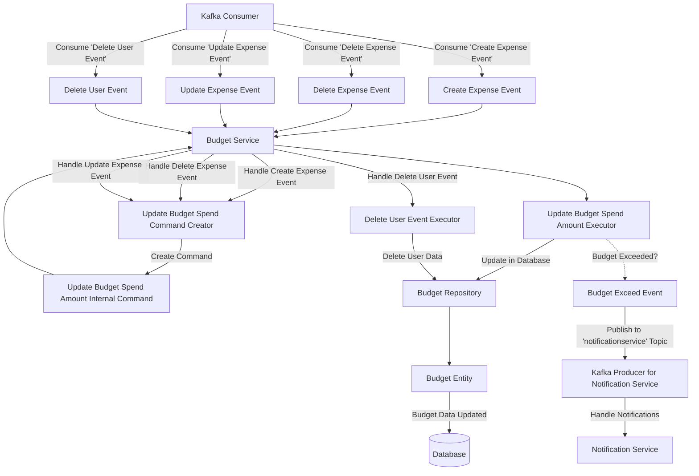

### Command and Query Handling

This diagram represents how commands and queries are handled by the system. The `Budget Command Controller` and `Budget Query Controller` interact with the `Budget Service`, which dispatches tasks to respective executors that manipulate the `Budget Entity` via the `Budget Repository`.

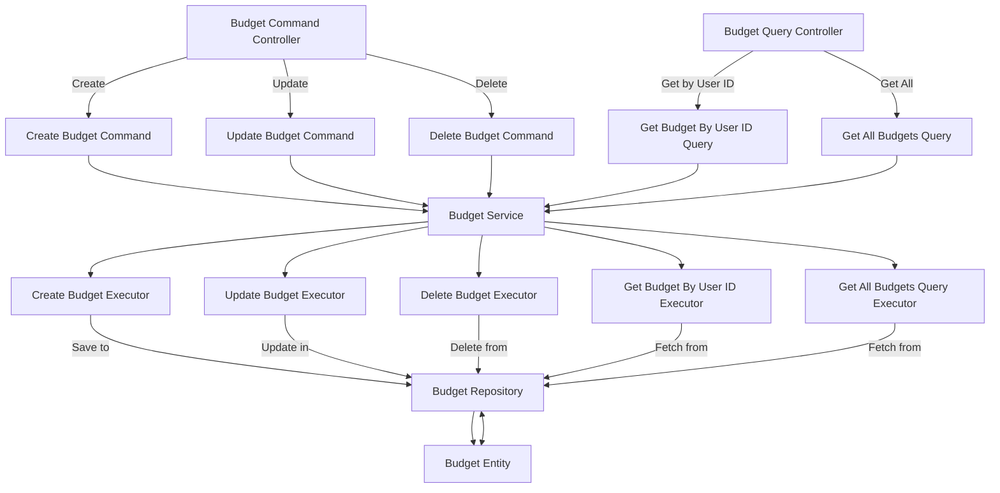

## Key Components

### Commands

Commands represent actions that modify the state of the system. Below are the key command classes used in this system:

#### CreateBudgetCommand

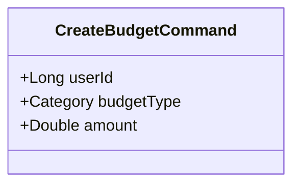

Handles the creation of a new budget.

#### UpdateBudgetCommand

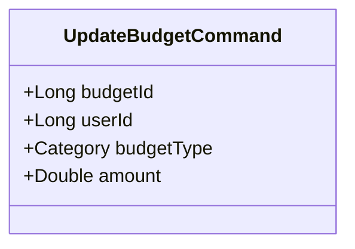

Handles the update of an existing budget.

#### DeleteBudgetCommand

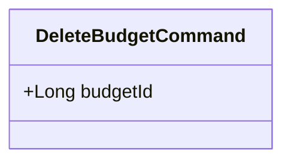

Handles the deletion of a budget.

#### UpdateBudgetSpendAmountInternalCommand

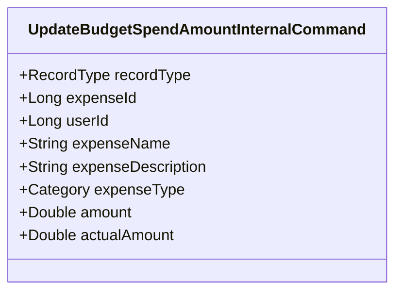

Handles the internal update of the budget spend amount, triggered by expense-related events.

### Entities

Entities represent the core data models within the system. The primary entity in this system is:

#### Budget Entity

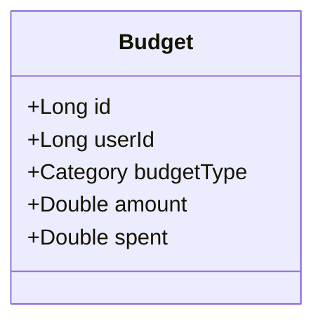

Represents a budget, including attributes such as `userId`, `budgetType`, `amount`, and `spent`.

### Events

Events represent changes or significant occurrences within the system that other components might need to respond to. The key event classes include:

#### CreateExpenseEvent

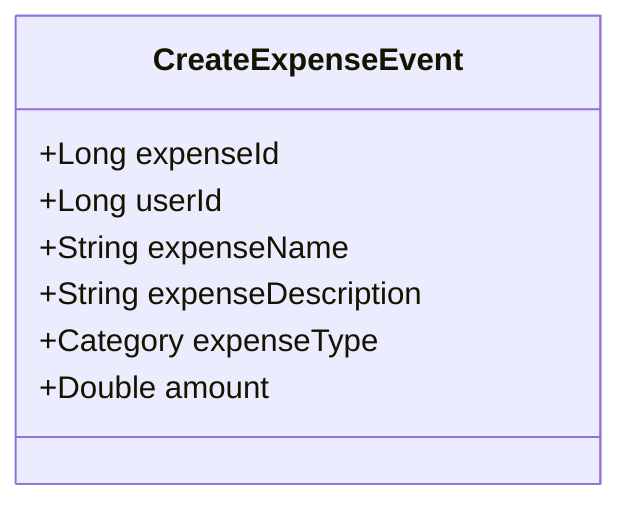

Triggered when a new expense is created.

#### DeleteExpenseEvent

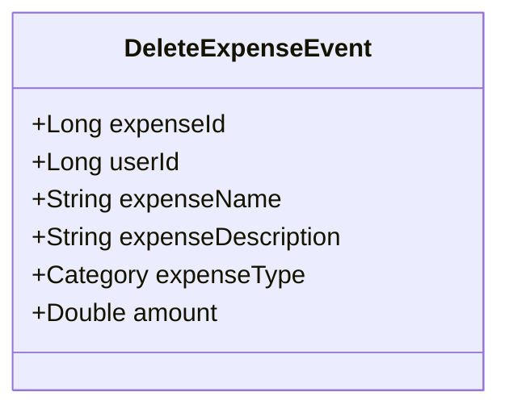

Triggered when an expense is deleted.

#### UpdateExpenseEvent

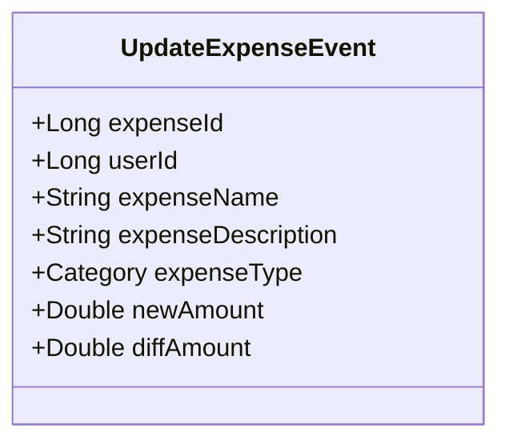

Triggered when an expense is updated.

#### DeleteUserEvent

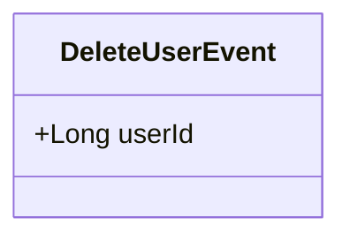

Triggered when a user is deleted, leading to the deletion of associated budgets.

#### BudgetExceedEvent

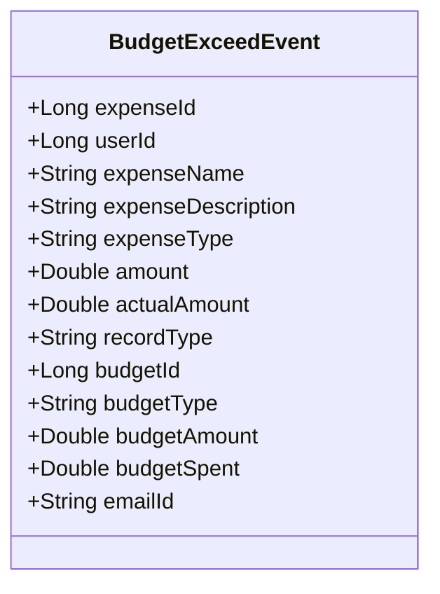

Triggered when the spent amount exceeds the budget, leading to a notification being sent.

## Conclusion

This `README.md` provides an overview of the architecture, components, and data flow in the budget management system. The system is designed to handle budget-related operations efficiently using an event-driven approach for expense events and direct command handling for budget management tasks.
