# Budget Management System

## Overview

The Budget Management System is designed to handle budget creation, updates, deletion, and querying operations. The system leverages an event-driven architecture with Kafka for handling expense-related events and integrates with a relational database for persistence.

## Sample output:


## Project Structure

- `api`: Core API interfaces.
- `command`: Classes encapsulating command details.
- `controller`: REST controllers managing HTTP requests.
- `event`: Event classes representing system actions.
- `executors`: Business logic processors for commands.
- `kafka`: Kafka message producers and consumers.
- `model`: Business entity data models.
- `query`: Data retrieval operations.
- `repo`: Database interaction.
- `service`: Business logic and service layer.

## Process Flow Diagram

This diagram illustrates how various events consumed from Kafka are processed by the Budget Service, which subsequently updates the budget data and produces notifications if necessary.

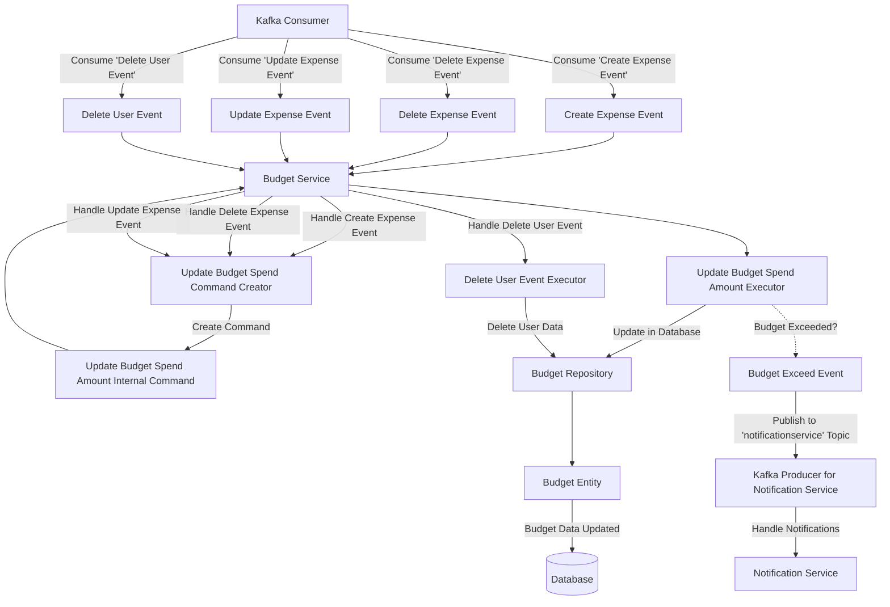

### Command and Query Handling

This diagram represents how commands and queries are handled by the system. The `Budget Command Controller` and `Budget Query Controller` interact with the `Budget Service`, which dispatches tasks to respective executors that manipulate the `Budget Entity` via the `Budget Repository`.

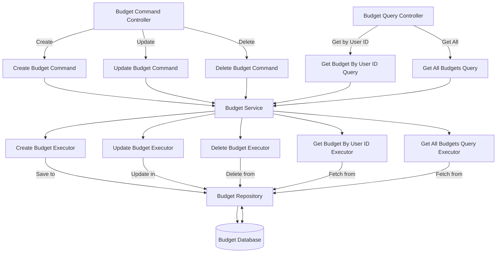

## Key Components

### Commands

Commands represent actions that modify the state of the system. Below are the key command classes used in this system:

#### CreateBudgetCommand

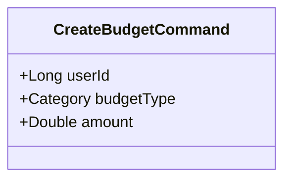

Handles the creation of a new budget.

#### UpdateBudgetCommand

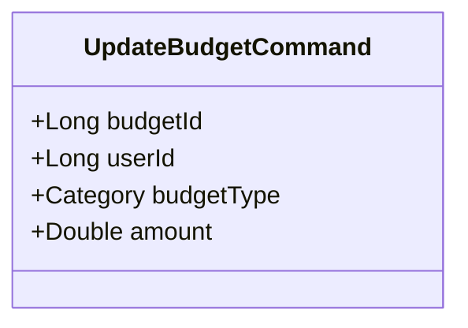

Handles the update of an existing budget.

#### DeleteBudgetCommand

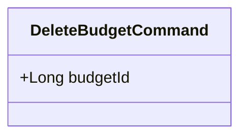

Handles the deletion of a budget.

#### UpdateBudgetSpendAmountInternalCommand

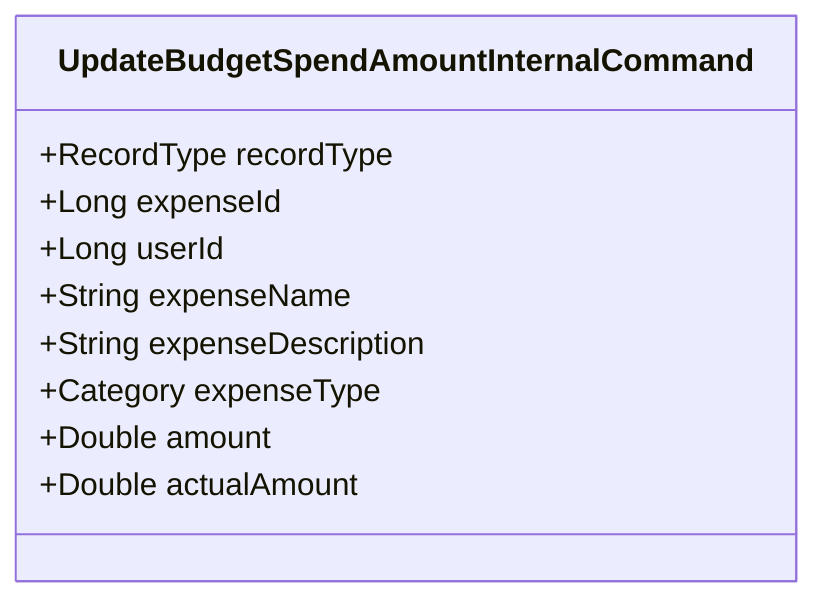

Handles the internal update of the budget spend amount, triggered by expense-related events.

### Entities

Entities represent the core data models within the system. The primary entity in this system is:

#### Budget Entity

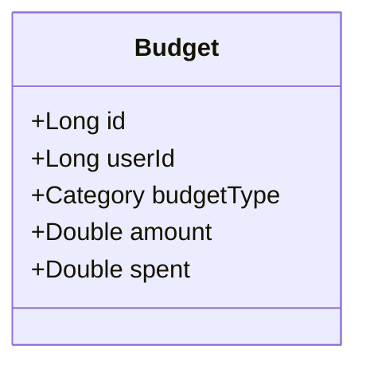

Represents a budget, including attributes such as `userId`, `budgetType`, `amount`, and `spent`.

### Events

Events represent changes or significant occurrences within the system that other components might need to respond to. The key event classes include:

#### CreateExpenseEvent

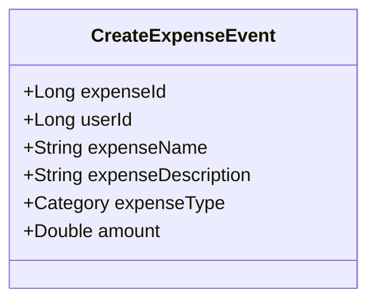

Triggered when a new expense is created.

#### DeleteExpenseEvent

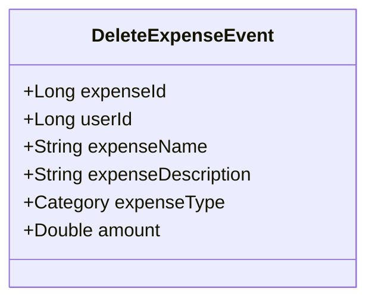

Triggered when an expense is deleted.

#### UpdateExpenseEvent

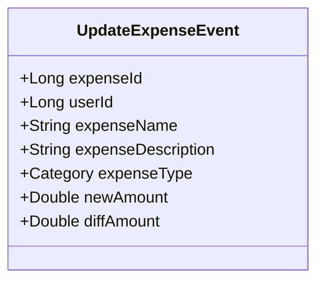

Triggered when an expense is updated.

#### DeleteUserEvent

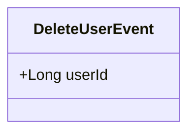

Triggered when a user is deleted, leading to the deletion of associated budgets.

#### BudgetExceedEvent

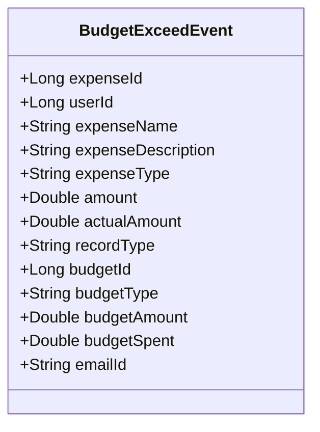

Triggered when the spent amount exceeds the budget, leading to a notification being sent.


## Getting Started

To run the service locally:

1. **Clone the repository**:
   ```bash
   git clone https://github.com/viswarajramji/budget.git
   cd budget
   ```

2. **Build the application**:
   ```bash
   ./mvnw clean install
   ```

3. **Start the application**:
   ```bash
   ./mvnw spring-boot:run
   ```

4. **Access the application** at `http://localhost:8082`.

5. **Access the database** at `http://localhost:8082/h2-console`.

**Note**: Ensure Kafka is running and the topic `userservice` is created.

## Swagger Endpoint

Access the Swagger UI to interact with the API:

- **URL**: `http://localhost:8082/swagger-ui.html`
